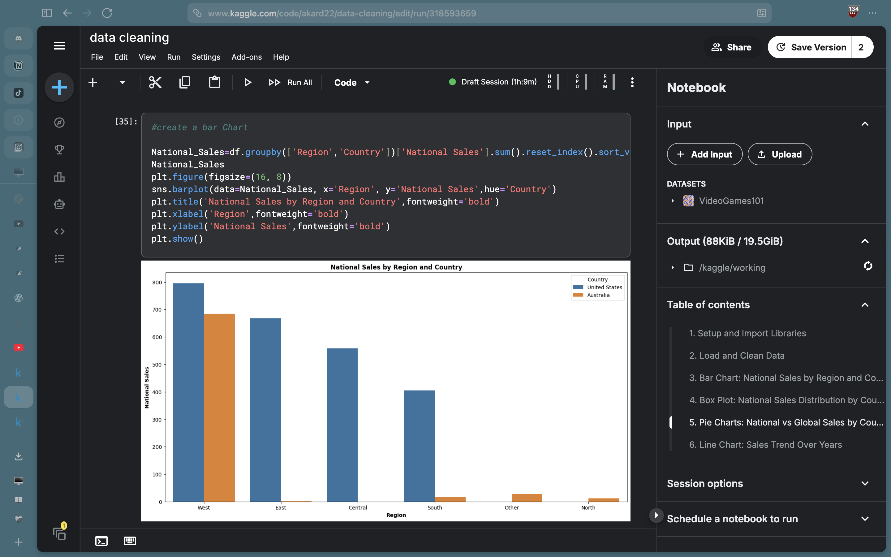

# 🎮 Video Game Sales Data Analysis

## 📌Project Overview
This project analyzes video game sales data from 2010 to 2017. The goal is to clean, explore, and visualize sales trends, identify top-performing genres, regions, and publishers, and provide actionable insights.

**Key Questions Answered:**
- Which region generates the most revenue?
- What are the best-selling genres globally vs. nationally?
- How have sales trended over the years?

##  Tools & Libraries Used
- **Python** (Pandas, NumPy) – Data cleaning & manipulation
- **Matplotlib & Seaborn** – Data visualization
- **Jupyter Notebook** – Interactive analysis

## Data Cleaning Steps
1. Removed duplicate rows
2. Handled missing values (filled with mean)
3. Removed `$` sign from sales columns & converted to numeric
4. Standardized country names (e.g., 'USA' → 'United States')
5. Capped outliers at 95th percentile to prevent distortion

##  Key Insights
- **United States** dominates both national and global sales (~70% market share)
- **West region** (USA) generates the highest national sales
- **Action & Shooter** genres are the top performers
- National and global sales show a slight decline after 2015 (may be due to missing data)

##  Visualizations
- **Bar Chart** – National sales by region and country
- **Box Plot** – Sales distribution by genre and country
- **Pie Charts** – National vs. global market share
- **Line Chart** – Sales trends over years

  ## 📸 Sample Visualization

##  How to Run This Project
1. Clone the repository:
git clone https://github.com/Talal580/video-game-sales-analysi.git
